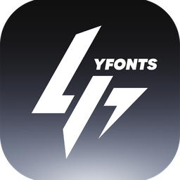

# YFonts

YFonts is a local-first desktop font manager for organizing, previewing, and
using large personal font collections.



## Features

- Scan folders containing TTF, OTF, TTC, WOFF, and WOFF2 files.
- Render real local font previews with Chinese and English sample text.
- Browse font families, weights, variable axes, categories, and license status.
- Search, filter, favorite, hide, remove, and restore fonts.
- Build project font packs with drag-and-drop organization.
- Open the source location of a font from the desktop application.
- Check GitHub Releases for application updates from Library Settings.
- Use light and dark themes with an integrated desktop title bar.
- Keep library indexes, project packs, and personal paths on the local device.

## Download

Windows builds are published on the
[Releases page](https://github.com/liangziye6/YFonts/releases).

The installer contains the application only. It does not include the
developer's fonts, local paths, favorites, or project packs.

## Development

Requirements:

- Node.js
- Rust
- Tauri system dependencies

```powershell
npm install
npm run dev
```

Run the desktop application:

```powershell
npm run desktop:dev
```

Build the Windows installer:

```powershell
npm run desktop:build
```

## Architecture

- `src/`: React and TypeScript application interface.
- `src-tauri/`: Tauri and Rust desktop commands.
- `docs/`: local library and cross-platform architecture notes.
- `scripts/`: font indexing and release verification helpers.

See [docs/ARCHITECTURE.md](docs/ARCHITECTURE.md) and
[docs/LOCAL_LIBRARY.md](docs/LOCAL_LIBRARY.md) for more detail.

## Privacy

YFonts is designed around local font libraries. Production builds do not
bundle `public/font-index.json` or any user-specific font paths. Per-user
library state is stored in the operating system's application data directory.

## Developer

Developed by **LYZ**.
